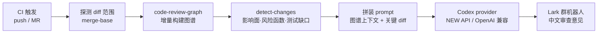

---

## 一、背景与痛点

日常 Code Review 有三类问题，人力评审容易漏，纯 diff 的 AI 评审根本看不见：

| 问题 | 纯 diff 评审 | 本方案 |
| --- | --- | --- |
| 改了一个函数，谁在调用它？ | 看不到，超出 diff 范围 | 图谱给出完整调用链与影响面 |
| 这次改动是否落在高风险函数上？ | 只能靠猜 | 图谱给出 risk level / 复杂度指标 |
| 新增分支是否有测试覆盖？ | 无从判断 | 图谱给出 test gap |

在 C++ 这类大型工程里尤其明显：一个 `.cpp` 的改动往往跨多个模块，评审者很难仅凭 diff 还原全貌。本方案把这些"隐藏上下文"结构化后一并交给模型，让评审意见从**代码风格建议**升级为**影响面分析**。

## 二、工作流程



1. **范围探测** —— 自动识别 GitLab CI / GitHub Actions / Jenkins，也支持手动传 `<new_sha> <base_sha>`。首次推分支时 `CI_COMMIT_BEFORE_SHA` 为全零，自动回退到 `merge-base origin/<默认分支>`。
2. **图谱构建** —— `code-review-graph` 增量更新代码结构图谱（符号、调用关系、复杂度、测试覆盖）。
3. **上下文提取** —— `detect-changes` 输出变更影响、风险函数、测试缺口。
4. **预算控制** —— 图谱 JSON 常达上百万字符，先按 `MAX_CONTEXT_CHARS` 截断，剩余预算留给 diff，避免撑爆上下文。
5. **模型评审** —— 调用 Codex provider 生成中文审查意见。
6. **结果通知** —— 以 Markdown 卡片推送到 Lark 群（项目、分支、作者、提交列表 + 审查意见）。

## 三、核心设计

- **图谱增强**：不是"看 diff 聊天"，而是携带结构化代码关系的评审。
- **Provider 无关**：只要兼容 OpenAI 协议即可——NEW API 中转、官方 API、自建代理都行。
- **双端点自动探测**：`CODEX_API_MODE=auto` 先试 `/v1/responses`，失败自动回退 `/v1/chat/completions`，不用关心 provider 暴露哪一种。
- **推理模型兼容**：`max_tokens` 被拒时自动改发 `max_completion_tokens`；`temperature` / `reasoning_effort` 未配置就不下发，规避 unsupported parameter 报错。
- **不阻塞流水线**：`allow_failure: true` + `interruptible: true`，审查是辅助流程。
- **跨平台**：一套脚本通吃 GitLab CI / GitHub Actions / Jenkins / 本地手动执行。

## 四、快速接入

1. 把 `ci_review.sh`、`review.py`、`requirements.txt` 放到目标仓库的 `.ci/` 目录。

2. CI 里加一个 job：

```yaml
ai_review:
  stage: test
  image: python:3.11
  allow_failure: true
  variables:
    GIT_DEPTH: "0"        # 图谱需要完整历史算 merge-base
  before_script:
    - git fetch origin "$CI_DEFAULT_BRANCH" || true
    - pip install -q -r .ci/requirements.txt
  script:
    - bash .ci/ci_review.sh
```

3. 配置密钥（GitLab：Settings → CI/CD → Variables，建议 Masked）：

| 变量 | 必填 | 说明 |
| --- | --- | --- |
| `CODEX_API_KEY` | ✅ | provider 令牌（NEW API 填平台 `sk-` 令牌，非上游厂商 key） |
| `CODEX_BASE_URL` | ✅ | OpenAI 兼容根地址，**以 `/v1` 结尾** |
| `CODEX_MODEL` | ✅ | 模型名，必须是 provider 模型列表里存在的名字 |
| `LARK_WEBHOOK_URL` | ✅ | 飞书群机器人 webhook |
| `CODEX_API_MODE` | | `auto`（默认）/ `chat` / `responses` |
| `CODEX_MAX_TOKENS` | | 默认 `8192` |
| `CODEX_REASONING_EFFORT` | | `low` / `medium` / `high`，未设置不下发 |
